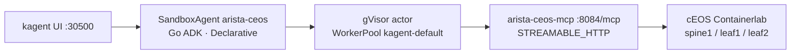

# Arista cEOS SandboxAgent

Read-only network operator for the isolated Containerlab cEOS demo
(`spine1`, `leaf1`, `leaf2`). Sibling of `fortigate` / `f5-bigip` /
`hello-substrate`. Pins unchanged: kagent **0.10.0-rc2**, Agent Substrate
**0.0.9**.

**Live verification pending.** GitOps + unit tests are in this repo. The
parallel Containerlab topology and eAPI reachability from dockerized k3s
have not been confirmed on Viper. Do not treat BGP, LLDP, or routes as
proven.

## Architecture

```text
kagent UI :30500
    → SandboxAgent/arista-ceos  (Go, gVisor, WorkerPool kagent-default)
        → RemoteMCPServer/arista-ceos-mcp
              http://arista-ceos-mcp.kagent:8084/mcp
            → Deployment/arista-ceos-mcp  (image arista-ceos-mcp:dev)
                → EOS eAPI JSON-RPC  POST /command-api
                   Basic auth from Vault · nodes from ARISTA_HOSTS_JSON
                   allowlist: spine1, leaf1, leaf2
```



**Planned fabric** (Containerlab verification still pending — do not
treat this as live): `spine1` / `leaf1` / `leaf2`, eBGP AS **65000** /
**65101** / **65102**, management network **172.20.20.0/24**. eAPI is
on that management network. A parallel repo owns the Containerlab
topology.

Backend switch image on Viper will be local **`ceos:4.33.9M`**, imported
from the official **`cEOS64-lab-4.33.9M.tar.xz`** (amd64). Do **not**
use Hub `sebbycorp/ceosimage` — that tag is arm64.

## Vault (key names only)

| | |
|--|--|
| Path | `secret/platform/arista-ceos` |
| Keys | `username`, `password`, and `hosts_json` (preferred) or `hosts` |
| Alias | ExternalSecret templates `hosts_json` if present, otherwise `hosts`. The MCP also reads `ARISTA_HOSTS`. |

`hosts_json` is a JSON object of **allowlisted node name → eAPI URL**.
Per-node objects (`url` / `host`, optional `username` / `password`) are
also accepted. Never put a password in git or in a PR body.

```json
{
  "spine1": "https://<mgmt-ip>",
  "leaf1": "https://<mgmt-ip>",
  "leaf2": "http://<mgmt-ip>"
}
```

Write the path on Viper after Vault login (placeholders only):

```bash
docker exec -it k3s-viper kubectl -n vault exec -i vault-0 -- \
  vault kv put secret/platform/arista-ceos \
    username='<eapi-user>' \
    password='<eapi-password>' \
    hosts_json='{"spine1":"https://<mgmt>","leaf1":"https://<mgmt>","leaf2":"https://<mgmt>"}'
```

The ExternalSecret maps those keys onto Secret `arista-ceos-mcp` in
`kagent`. ClusterSecretStore is `vault-backend`.

| Target env | Vault property |
|------------|----------------|
| `ARISTA_USERNAME` | `username` |
| `ARISTA_PASSWORD` | `password` |
| `ARISTA_HOSTS_JSON` | `hosts_json` |

The Deployment also sets `ARISTA_ALLOWED_NODES=spine1,leaf1,leaf2` and
`ARISTA_VERIFY_TLS=false` (lab only). The MCP process **defaults TLS
verify on** when that env is unset.

## Tools

Each `arista_*` tool is a thin eAPI `runCmds` wrapper. Commands are
`show` only. There is **no** generic CLI tool. The model may pass a
node **name**; URLs and unknown hosts are rejected.

| Tool | eAPI show | Scope |
|------|-----------|--------|
| `arista_inventory` | `show version` | all allowlisted nodes |
| `arista_bgp_summary` | `show ip bgp summary` | one node or all |
| `arista_interfaces` | `show interfaces` | one node |
| `arista_lldp_neighbors` | `show lldp neighbors` | one node or all |
| `arista_routes` | `show ip route` `[prefix]` | one node; optional IPv4 filter |
| `arista_health` | version + BGP + interfaces | all nodes, concise |

## Import + apply (dockerized k3s Viper)

On Viper, after this PR is on main (and after Vault keys exist):

```bash
# from the repo root
docker build -t arista-ceos-mcp:dev images/arista-ceos-mcp
docker save arista-ceos-mcp:dev | docker exec -i k3s-viper ctr images import -
# Argo syncs platform/kagent-ai, or:
kubectl kustomize platform/kagent-ai | docker exec -i k3s-viper kubectl apply -f -
```

`ImagePullBackOff` means the import has not landed. There is no registry
pull for `arista-ceos-mcp:dev`.

```bash
docker exec k3s-viper kubectl -n kagent get sandboxagents,remotemcpservers
docker exec k3s-viper kubectl -n kagent get deploy,pods,svc -l app.kubernetes.io/name=arista-ceos-mcp
docker exec k3s-viper kubectl -n kagent get externalsecret arista-ceos-mcp
```

Wait for `SandboxAgent/arista-ceos` Ready and
`RemoteMCPServer/arista-ceos-mcp` Accepted. First golden snapshot can
take 60–90s (same as hello-substrate).

A2A path: `POST /api/a2a-sandboxes/kagent/arista-ceos` (classic
`/api/a2a/` 404s).

## Example questions

- Which nodes are up, and what EOS version are they running?
- Are the eBGP sessions from spine1 to the leaves Established?
- Who does leaf1 see on LLDP?
- What IPv4 routes does spine1 have? (optional prefix filter — do not invent a prefix)

## GitOps

Wired into existing Argo app **`platform-kagent-ai`** (wave 5, prune +
self-heal). No new Application. No `ignoreDifferences`. No
`spec.skills` (rc2 CEL rejects it). No `snapshotsConfig`. Skills live
in ConfigMap `arista-ceos-skills` and are included via
`declarative.promptTemplate`.

| Piece | Path |
|-------|------|
| Image | `images/arista-ceos-mcp/` |
| ExternalSecret | `platform/kagent-ai/arista-ceos-external-secret.yaml` |
| Deployment + Service + RemoteMCPServer | `platform/kagent-ai/arista-ceos-mcp.yaml` |
| Skills ConfigMap | `platform/kagent-ai/arista-ceos-skills.yaml` |
| SandboxAgent | `platform/kagent-ai/arista-ceos-agent.yaml` |
| Kustomization | `platform/kagent-ai/kustomization.yaml` |

`hello-substrate.yaml`, `fortigate-*.yaml`, and `f5-bigip-*.yaml` are
not modified.

## Honest limits

- **Live verification pending.** Do not invent that Containerlab or eAPI
  is reachable from `k3s-viper`.
- **Image must be imported** (`ctr images import`) before the MCP pod
  can start.
- **Vault path must exist** or ExternalSecret stays unsynced and the pod
  cannot mount `Secret/arista-ceos-mcp`.
- **Allowlist is env-only.** Extra hosts in Vault are ignored unless
  they are also in `ARISTA_ALLOWED_NODES`.
- **TLS verify off is lab-only** (`ARISTA_VERIFY_TLS=false` on the
  Deployment). The process default is verify on.
- **Read-only.** No config, clear, reload, or bash tools.
- **LAN only.** Do not publish `:30500` or cEOS eAPI to the public
  internet.
- **Never commit the eAPI password.** Key names only.

## Related

- Cluster agent: [kagent-substrate.md](kagent-substrate.md)
- FortiGate agent: [fortigate-agent.md](fortigate-agent.md)
- F5 agent: [f5-bigip-agent.md](f5-bigip-agent.md)
- Vault inventory: [vault-eso-setup.md](vault-eso-setup.md)
- UI ports: [platform-ui-access.md](platform-ui-access.md)
