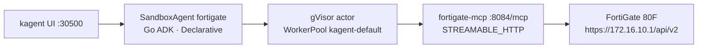
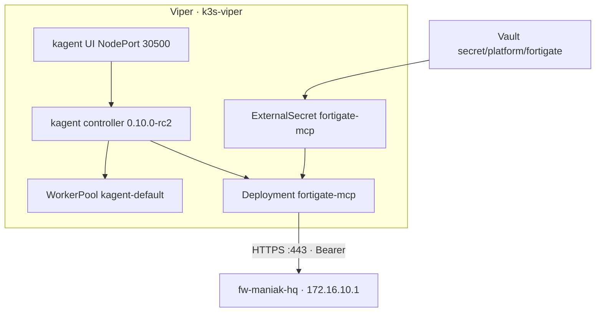

# FortiGate SandboxAgent (fw-maniak-hq)

Dedicated runbook for the **home FortiGate** agent. Sibling of
`hello-substrate` — that agent is unchanged.

| Piece | Pin / fact |
|-------|------------|
| Agent | Go **SandboxAgent** `fortigate` in namespace `kagent` |
| Runtime | Agent Substrate **0.0.9** (gVisor actor, WorkerPool `kagent-default`) |
| Controller / UI | OSS kagent **0.10.0-rc2** · UI [http://172.16.10.135:30500/](http://172.16.10.135:30500/) |
| Box | FortiGate **80F** · hostname **fw-maniak-hq** · FortiOS **v7.4.11** build 2878 · VDOM `root` |
| API | `https://172.16.10.1:443` (lab self-signed). Host IP is fine to document. |
| Tools | FastMCP image `fortigate-mcp:dev` · STREAMABLE_HTTP `:8084/mcp` |

This is a **firewall** agent. It does not attach `k8s_get_*` from
`kagent-tool-server`. For cluster questions use `hello-substrate`.

## Architecture



Same path in the repo's usual text form:

```text
kagent UI :30500
    → SandboxAgent/fortigate  (Go, modelConfig default-model-config)
        → Agent Substrate WorkerPool kagent-default  (gVisor ateom)
            → RemoteMCPServer/fortigate-mcp
                  http://fortigate-mcp.kagent:8084/mcp
                → Deployment/fortigate-mcp  (image fortigate-mcp:dev)
                    → https://172.16.10.1/api/v2   Bearer token from Vault
```



## Secrets (Vault + ESO, not git)

The REST admin token and the API host stay in Vault. Git has the
`ExternalSecret` only. Do **not** put the token, a password, or a sample
JSON Authorization header in this repo, a PR body, or chat screenshots.

| Where | What |
|-------|------|
| Vault KV | `secret/platform/fortigate` keys `token`, `host` |
| ExternalSecret | `platform/kagent-ai/fortigate-external-secret.yaml` |
| Target Secret | `fortigate-mcp` in `kagent` · `FORTIGATE_TOKEN` / `FORTIGATE_HOST` |
| Pod env | `FORTIGATE_VERIFY_TLS=false` (lab self-signed, `curl -k` equivalent) |

Write the path on Viper after Vault login (paste the token locally; the
placeholder below is not a real value):

```bash
docker exec -it k3s-viper kubectl -n vault exec -i vault-0 -- \
  vault kv put secret/platform/fortigate \
    token='<rest-api-token>' \
    host='https://172.16.10.1'
```

REST admin username on the box is `Agentsubstrate`. That name is not a
secret. The token and any admin password are.

## Tools

Each `fg_*` tool is a thin FortiOS REST wrapper. Lists are compacted
(`format=` where useful) and truncated. There is **no** generic "call any
path" tool. Do not call the broken paths
`/api/v2/monitor/log/event`, `/monitor/log/threat`, or
`/cmdb/firewall/service/custom` (slash — the live path uses a **dot**:
`/api/v2/cmdb/firewall.service/custom`).

| Tool | FortiOS path | Mode |
|------|----------------|------|
| `fg_system_status` | `GET /api/v2/monitor/system/status` (+ `…/performance/status` if 200) | read |
| `fg_resource_usage` | `GET /api/v2/monitor/system/resource/usage` | read |
| `fg_list_interfaces` | `GET /api/v2/cmdb/system/interface` | read |
| `fg_interface_stats` | `GET /api/v2/monitor/system/interface` | read |
| `fg_list_policies` | `GET /api/v2/cmdb/firewall/policy` | read |
| `fg_get_policy` | `GET /api/v2/cmdb/firewall/policy/{id}` | read |
| `fg_policy_stats` | `GET /api/v2/monitor/firewall/policy` | read |
| `fg_list_addresses` | `GET /api/v2/cmdb/firewall/address` | read |
| `fg_list_addrgrp` | `GET /api/v2/cmdb/firewall/addrgrp` | read |
| `fg_list_services` | `GET /api/v2/cmdb/firewall.service/custom` and `…/group` | read |
| `fg_list_routes` | `GET /api/v2/monitor/router/ipv4` | read |
| `fg_list_static_routes` | `GET /api/v2/cmdb/router/static` | read |
| `fg_vpn_status` | `GET /api/v2/monitor/vpn/ipsec`, `…/vpn/ssl`, `…/cmdb/vpn.ipsec/phase1-interface` | read |
| `fg_dhcp_leases` | `GET /api/v2/monitor/system/dhcp` | read |
| `fg_list_vips` | `GET /api/v2/cmdb/firewall/vip` | read |
| `fg_log_state` | `GET /api/v2/monitor/log/device/state`, `…/log/forticloud` | read |
| `fg_current_admins` | `GET /api/v2/monitor/system/current-admins` | read |
| `fg_create_address` | `POST /api/v2/cmdb/firewall/address` | write |
| `fg_update_address` | `PUT /api/v2/cmdb/firewall/address/{name}` | write |
| `fg_set_policy_status` | `PUT /api/v2/cmdb/firewall/policy/{id}` `status=enable\|disable` | write |
| `fg_create_policy` | `POST /api/v2/cmdb/firewall/policy` (create only, no delete) | write |
| `fg_update_policy_comment` | `PUT /api/v2/cmdb/firewall/policy/{id}` `comments` | write |

The system prompt tells the model to **ask before writes**.

## Chat

1. Open [http://172.16.10.135:30500/](http://172.16.10.135:30500/).
2. Pick **kagent/fortigate** (leave **kagent/hello-substrate** for cluster questions).
3. Ask something like: `What is fw-maniak-hq running, and which WAN is up?`

```bash
docker exec k3s-viper kubectl -n kagent get sandboxagents,remotemcpservers
docker exec k3s-viper kubectl -n kagent get deploy,pods,svc -l app.kubernetes.io/name=fortigate-mcp
docker exec k3s-viper kubectl -n kagent get externalsecret fortigate-mcp
```

Wait for `SandboxAgent/fortigate` Ready and `RemoteMCPServer/fortigate-mcp`
Accepted. First golden snapshot can take 60–90s (same as hello-substrate).

## Rebuild / import the image on Viper

Same local-import pattern as `viper-desktop:dev`:

```bash
# on Viper, from the repo root
docker build -t fortigate-mcp:dev images/fortigate-mcp
docker save fortigate-mcp:dev | docker exec -i k3s-viper ctr images import -
```

`ImagePullBackOff` means the import has not landed (or the tag does not
match). There is no registry pull for `fortigate-mcp:dev`.

Optional publish (not required for the lab path):

```bash
docker tag fortigate-mcp:dev ghcr.io/sebbycorp/fortigate-mcp:dev
```

## GitOps

Wired into existing Argo app **`platform-kagent-ai`** (wave 5, prune +
self-heal). No new Application. No `ignoreDifferences`.

| Piece | Path |
|-------|------|
| Image | `images/fortigate-mcp/` |
| ExternalSecret | `platform/kagent-ai/fortigate-external-secret.yaml` |
| Deployment + Service + RemoteMCPServer | `platform/kagent-ai/fortigate-mcp.yaml` |
| SandboxAgent | `platform/kagent-ai/fortigate-agent.yaml` |
| Kustomization | `platform/kagent-ai/kustomization.yaml` |

`hello-substrate.yaml` is not modified.

## Example configs (redacted)

SandboxAgent (tools list abbreviated in this snippet — full list is in
git):

```yaml
apiVersion: kagent.dev/v1alpha2
kind: SandboxAgent
metadata:
  name: fortigate
  namespace: kagent
spec:
  type: Declarative
  declarative:
    runtime: go
    modelConfig: default-model-config
    tools:
      - type: McpServer
        mcpServer:
          name: fortigate-mcp
          kind: RemoteMCPServer
          apiGroup: kagent.dev
          toolNames: [fg_system_status, fg_list_policies]
    # systemMessage: home FortiGate assistant for fw-maniak-hq …
  substrate:
    workerPoolRef:
      name: kagent-default
```

RemoteMCPServer — fields from kagent-crds **0.10.0-rc2** / live
`kagent-tool-server` (`description`, `url`, `protocol`, `timeout`,
`sseReadTimeout`). No invented keys. No TLS block on `http://`.

```yaml
apiVersion: kagent.dev/v1alpha2
kind: RemoteMCPServer
metadata:
  name: fortigate-mcp
  namespace: kagent
spec:
  description: FortiOS REST tools for fw-maniak-hq (FortiGate 80F)
  protocol: STREAMABLE_HTTP
  timeout: 30s
  sseReadTimeout: 5m0s
  url: http://fortigate-mcp.kagent:8084/mcp
```

## Honest limits

- **Image must be imported** (`ctr images import`) before the MCP pod can start.
- **Vault path must exist** or ExternalSecret stays unsynced and the pod
  cannot mount `Secret/fortigate-mcp`.
- **Self-signed API** — `FORTIGATE_VERIFY_TLS=false` is lab-only.
- **No delete / backup / firmware** tools. Confirm writes in chat.
- **LAN only.** Do not publish `:30500` or the FortiGate API to the public internet.
- **Never commit the REST token.** Host `172.16.10.1` is fine to document.

## Related

- Cluster agent: [kagent-substrate.md](kagent-substrate.md)
- Vault inventory: [vault-eso-setup.md](vault-eso-setup.md)
- UI ports: [platform-ui-access.md](platform-ui-access.md)
