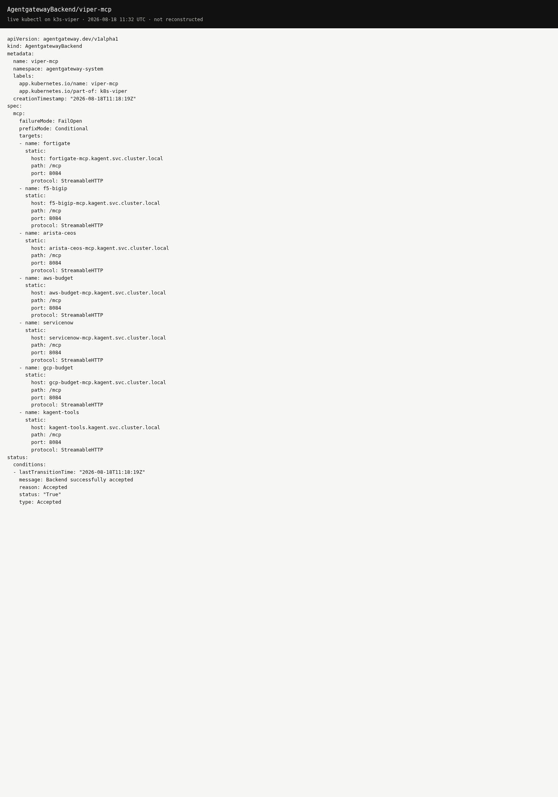
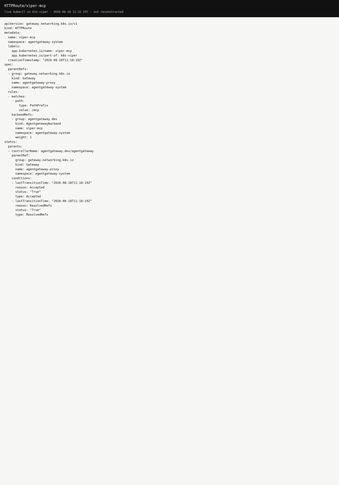

# MCP servers on Viper

Catalog of every MCP server on this lab, the **one** agentgateway front door, and how to use **Grok Bot** as the agentic client so you do not hand Fortigate / F5 / cloud tools to every IDE.

LAN only. Not on [viper.maniak.ai](https://viper.maniak.ai/). Never put Vault values in git or in chat.

Companion: [agentgateway-mcp.md](../agentgateway-mcp.md) (short client card).

## Front door

One Gateway, already used for OpenAI and Spark:

| | |
|--|--|
| Gateway | `agentgateway-proxy` in `agentgateway-system` |
| NodePort | **30100** |
| MCP URL | `http://172.16.10.135:30100/mcp` |
| Transport | Streamable HTTP |
| Client auth | none (same as `/spark`). Anything on the LAN that can hit `:30100` can call these tools. |
| Git | `platform/agentgateway-ai/backend-viper-mcp.yaml`, `httproute-viper-mcp.yaml` |

```text
Grok Bot / Cursor / Inspector
        │
        │  Streamable HTTP
        ▼
agentgateway-proxy :30100 /mcp     (viper-mcp AgentgatewayBackend)
        │
        ├─ fortigate-mcp.kagent:8084/mcp
        ├─ f5-bigip-mcp.kagent:8084/mcp
        ├─ arista-ceos-mcp.kagent:8084/mcp
        ├─ aws-budget-mcp.kagent:8084/mcp
        ├─ servicenow-mcp.kagent:8084/mcp
        ├─ gcp-budget-mcp.kagent:8084/mcp
        └─ kagent-tools.kagent:8084/mcp
                │
                ▼
        FortiGate / BIG-IP / cEOS / AWS / ServiceNow / GCP / k8s API
```

kagent SandboxAgents still talk to the ClusterIP Services directly (`RemoteMCPServer` in `kagent`). The gateway is the extra front door for Grok Bot and other MCP clients.

## agentgateway configuration

Chart **1.4.1**. Same Gateway as `/v1`, `/openai`, `/spark`, `/desktop/`.

`AgentgatewayBackend/viper-mcp`:

- `spec.mcp.failureMode: FailOpen` (one down MCP does not kill the session)
- `spec.mcp.prefixMode: Conditional` (tool names become `target_tool` because there are many targets)
- each target is `static.host` + `port: 8084` + `path: /mcp` + `protocol: StreamableHTTP`
- `backendRef` is namespace-local only, so these use cluster DNS (`*.kagent.svc.cluster.local`)

`HTTPRoute/viper-mcp` attaches to `agentgateway-proxy`, path prefix `/mcp`.

```bash
docker exec k3s-viper kubectl -n agentgateway-system get agentgatewaybackend viper-mcp
docker exec k3s-viper kubectl -n agentgateway-system get httproute viper-mcp
```

Live captures from `kubectl` on k3s-viper, 2026-08-18 (status Accepted). The agentgateway admin port (15000) is not published on this lab, so these are the live CRs, not a reconstructed admin UI.






## All MCP servers

Every server is a Deployment + ClusterIP in `kagent`, `STREAMABLE_HTTP` on `:8084/mcp`. Images are imported on the node (`IfNotPresent`). Creds come from Vault via ExternalSecret. Path **names** only below.

| Gateway prefix | Service | SandboxAgent | Target | Vault path | Git |
|----------------|---------|--------------|--------|------------|-----|
| `fortigate_` | `fortigate-mcp` | fortigate | FortiGate 80F `172.16.10.1` | `secret/platform/fortigate` | `platform/kagent-ai/fortigate-*.yaml`, `images/fortigate-mcp/` |
| `f5-bigip_` | `f5-bigip-mcp` | f5-bigip | BIG-IP `172.16.10.10` | `secret/platform/f5-bigip` | `platform/kagent-ai/f5-bigip-*.yaml`, `images/f5-bigip-mcp/` |
| `arista-ceos_` | `arista-ceos-mcp` | arista-ceos | Containerlab cEOS eAPI | `secret/platform/arista-ceos` | `platform/kagent-ai/arista-ceos-*.yaml`, `images/arista-ceos-mcp/` |
| `aws-budget_` | `aws-budget-mcp` | aws-budget | AWS us-east-2 billing / capacity | `secret/platform/aws-budget` | demos `aws-sandbox-agent` (applied on Viper) |
| `servicenow_` | `servicenow-mcp` | servicenow | ServiceNow IT tickets | `secret/platform/servicenow` | demos `service-now-sandbox-agent` (applied on Viper) |
| `gcp-budget_` | `gcp-budget-mcp` | gcp-budget | GCP us-east1 billing / capacity | `secret/platform/gcp-budget` | demos `gcp-sandbox-agent` (applied on Viper) |
| `kagent-tools_` | `kagent-tools` | hello-substrate | in-cluster k8s reads | (kagent SA) | kagent Helm + `platform/kagent-ai/hello-substrate.yaml` |

Demos repo: [sebbycorp/kagent-agent-substrate-demos](https://github.com/sebbycorp/kagent-agent-substrate-demos).

A live `tools/list` through the gateway (2026-08-18) returned **185** tools: fortigate 22, f5-bigip 6, arista-ceos 6, aws-budget 11, servicenow 8, gcp-budget 8, kagent-tools 124.

## Use Grok Bot as the secure client

Grok Bot (the k8s-viper agent) is the intended agentic front door. You ask it to do infra work. It reaches Viper. You do not paste tokens, and you do not publish `/mcp`.

Why this is the secure path:

1. MCP *servers* stay ClusterIP. Only `:30100` is on the node, and it is LAN.
2. Device passwords and cloud keys stay in Vault. Grok Bot never needs them in chat.
3. One client identity (this agent) instead of every laptop speaking FortiOS / iControl / eAPI.
4. Public site and GitHub Pages stay documentation-only.

### Daily use

Open the **k8s-viper** Grok Bot chat and ask in plain language, for example:

- "What is the BGP summary on spine1?"
- "List Fortigate policies that mention YouTube."
- "AWS MTD spend in us-east-2."

The agent already has a jump onto Viper and can call `http://127.0.0.1:30100/mcp` from the host. You do not configure MCP in the Grok Bot Plugins marketplace for the common case.

### Optional: attach the multiplex as a Grok Bot connector

Only do this if you want raw MCP tools inside Grok Bot itself (not just via k8s-viper's Viper jump).

1. Tell k8s-viper: "Add the Viper MCP connector at `http://172.16.10.135:30100/mcp`."
2. Confirm the add. That changes the Cursor / Grok Bot account (custom remote MCP).
3. The Grok Bot computer is **not** on the 172.16.10.0/24 LAN. A direct add of that URL will time out unless you first put a tunnel or the connector is reached from a path that can see Viper.
4. Do not paste a Vault token into chat. If the route later grows a bearer header, use Grok Bot's secret-request card, not a paste.

Until a tunnel exists, prefer the k8s-viper chat (jump onto Viper, then `/mcp` on localhost).

### Cursor on the home LAN

If your laptop is on the LAN, you can point Cursor at the same URL. Still do not put this on a public machine.

```json
{
  "mcpServers": {
    "viper": {
      "url": "http://172.16.10.135:30100/mcp"
    }
  }
}
```

MCP Inspector on the LAN:

```bash
npx @modelcontextprotocol/inspector@0.21.2
```

Transport **Streamable HTTP**, URL `http://172.16.10.135:30100/mcp`.

## Rules

- Do not publish `:30100` or kagent `:30500` on the public site.
- Do not commit secret values. Vault path names only.
- Do not bump kagent **0.10.0-rc2** or Substrate **0.0.9** to "fix" a missing tool.
- `GET /` on `:30100` is 404 `route not found`. That is expected. Use `/mcp`, `/v1`, or `/spark`.
